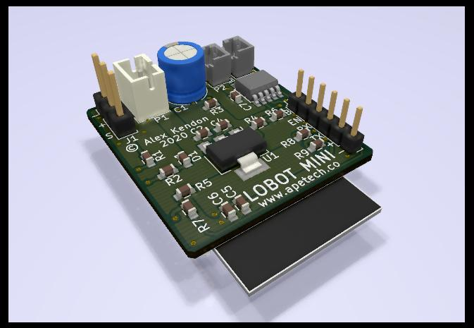
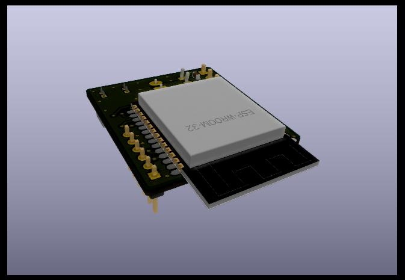
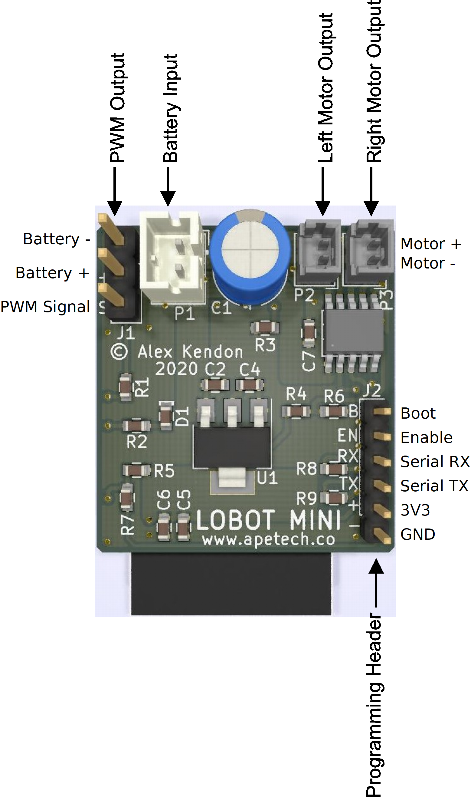

# Lobot-Mini
An ESP32-based controller for FRA Antweight (SPARC Fairyweight) robots

# NOTE:
**This project is still under heavy development!!!** Everything you need to build your own Lobot-Mini board and control it from and Android device is here, but it is very much in an Alpha/Debug state. If there is enough interest I will continue to develop proper release versions of the firmware and app.

## Background
Over the last couple of years, in my spare time, I've been developing a simple low-cost robot called [Lobot](https://github.com/Apetech-NZ/Lobot). After I got involved in combat robotics I noted that the cost of the hardware, the transmitter in particular, was a barrier for some people. I realised that Lobot actually already had all the necessary functionality to control an Antweight robot, but it is designed as a standalone device with the drive motors, battery etc... mounted directly to the PCB and size optimized for hand-assembly. I stripped out all the unnecessary functionality and shrank the board as much as possible (without increasing the cost of the PCB too much and still allowing for hand-assembly). To keep the cost and size down I've kept the design relatively simple and haven't included much in the way of protection (same as most hobby-grade electronics).

## Features
- Bluetooth communication (Control via BT3, BTLE is available)
- Wifi connectivity (just for firmware updates at this stage)
- Dual H-bridge output for driving N20 or similar brushed motors
- PWM output for a servo or ESC

## Specifications
- Battery Voltage: 4.6~10V (Designed for 2S)
- Motor Current: TBD

## Pinout

# Building It
If you would like to build a Lobot-Mini board please consider purchasing the PCBs from my project page on [PCB Way](https://www.pcbway.com/project/shareproject/Lobot_Mini.html). I get a small percentage of the PCB purchase price and every cent helps me keep developing Lobot-Mini
